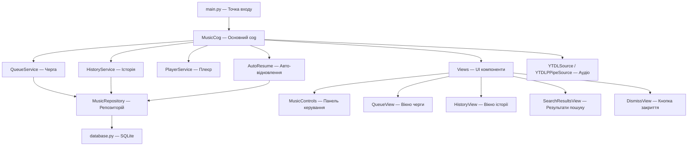

# 🎵 Discord Music Bot — Підготовка до захисту проєкту

## Загальний опис

**Discord Music Bot** — це музичний бот для Discord, написаний на Python з використанням бібліотеки `discord.py`. Бот дозволяє користувачам слухати музику з YouTube прямо у голосових каналах Discord-сервера. Він підтримує черги треків, історію прослуховувань, керування гучністю, пошук музики, плейлисти, а також автоматичне відновлення роботи після перезапуску. Проєкт контейнеризований (Docker) для зручного розгортання.

---

## Архітектура проєкту

Архітектура побудована за **SOLID-принципами**:
- **SRP** (Single Responsibility) — кожен файл/клас має одну чітку відповідальність
- **DIP** (Dependency Inversion) — сервіси залежать від абстракцій (репозиторію)
- **ISP** (Interface Segregation) — сервіси черги та історії розділені

---

## Опис файлів — що за що відповідає

### Кореневі файли

| Файл | Призначення |
|------|-------------|
| `main.py` | **Точка входу** — ініціалізує бота, налаштовує логування з ротацією файлів, завантажує коги, запускає healthcheck для зомбі-процесів, містить singleton lock (щоб не запускались дві копії бота одночасно) |
| `Dockerfile` | **Docker-образ** — multi-stage build: (1) встановлює Python-залежності, (2) копіює ffmpeg, opus, yt-dlp, створює non-root користувача `botuser`, healthcheck через PID-файл |
| `docker-compose.yml` | **Оркестрація** — запускає бот-контейнер із персистентними volumes для БД та логів, обмеження пам'яті 512MB |
| `requirements.txt` | Залежності: `discord.py[voice]`, `yt-dlp`, `python-dotenv`, `aiosqlite` |
| `.env` | Зберігає `DISCORD_TOKEN` (секретний токен бота) |

---

### Основний пакет (`discord_music_bot/`)

#### `config.py` — Конфігурація
- Завантажує `.env` через `python-dotenv`
- Містить налаштування **yt-dlp** (`YDL_OPTIONS`): формат аудіо (Opus HQ), без плейлистів за замовчуванням
- Містить налаштування **FFmpeg** (`FFMPEG_OPTIONS`): частота 48kHz, стерео, reconnect при розриві з'єднання

#### `consts.py` — Константи
- Усі «магічні числа» та рядки винесені сюди
- **Пагінація**: кількість елементів на сторінку (10 для черги, 5 для пошуку)
- **Таймаути**: від'єднання від каналу (60с), перепідключення (3 спроби по 2с)
- **Кольори embed**: фіолетовий для звичайних, синій для програвання
- **Емодзі**: всі іконки кнопок (⏮️, ⏸️, ▶️, ⏭️ тощо)
- **Гучність**: мін 0%, макс 200%, крок 10%, за замовчуванням 50%
- **Повідомлення**: локалізовані (українською) рядки помилок та статусів

#### `database.py` — Ініціалізація бази даних
- Створює **SQLite** базу з трьома таблицями:
  - `guild_state` — стан бота для кожного Discord-сервера (який канал, який трек грає, пауза)
  - `queue_tracks` — черга треків (позиція, URL, назва, тривалість, thumbnail)
  - `history_tracks` — історія прослуховувань
- Використовує **WAL mode** (Write-Ahead Logging) для кращої конкурентності
- Індекси на guild_id + position/played_at для швидких запитів

#### `repository.py` — Патерн Repository
- Клас `MusicRepository` — **абстрагує** всю роботу з БД
- Методи для guild_state: `save_guild_state()`, `load_guild_state()`, `get_all_active_guilds()`, `clear_guild_state()`
- Методи для черги: `save_queue()` (атомарне збереження через транзакцію + `executemany`), `load_queue()`, `clear_queue()`
- Методи для історії: `add_history_track()`, `get_history()`, `pop_last_history_track()`, `clear_history()`
- Статистика: `get_top_tracks()`, `get_total_listening_time()`, `get_listening_stats()`, `search_history()`
- Кожний метод сам відкриває/закриває з'єднання → безпечно для конкурентного доступу

#### `audio_source.py` — Аудіо pipeline
- **`YTDLPPipeSource`** — кастомний `AudioSource` для Discord:
  - Працює через pipeline: `yt-dlp → pipe → FFmpeg → pipe → Discord`
  - Буферизація даних для уникнення передчасного закінчення треку
  - Retry-механізм (до 10 спроб по 100мс) при мережевих затримках
  - FFmpeg фільтри `aresample` та `asetpts` для фіксу стрибків швидкості
- **`YTDLSource`** — обгортка `PCMVolumeTransformer`:
  - `from_url()` — створює аудіо source: витягує метадані через yt-dlp, запускає subprocess pipeline
  - Зберігає метадані: назва, URL, тривалість, thumbnail

#### `healthcheck.py` — Моніторинг зомбі-процесів
- Фоновий async task, який кожні 5 хвилин знаходить та «вбиває» orphaned процеси yt-dlp/ffmpeg
- Працює як на Windows (`tasklist` + `taskkill`), так і на Linux (`ps` + `SIGKILL`)
- Запобігає витоку системних ресурсів при тривалій роботі бота

#### `utils.py` — Утиліти
- `format_duration()` — форматує секунди у `HH:MM:SS` або `MM:SS`

---

### Сервіси (`services/`)

#### `queue_service.py` — Сервіс черги
- **In-memory кеш** (`Dict[guild_id, List[track]]`) + асинхронна персистенція в SQLite
- Операції: `add_track()`, `add_tracks()` (для плейлистів), `get_next_track()`, `shuffle()`, `move_track()`, `push_front()`, `peek_next()`
- Кожна зміна автоматично зберігається в БД через `asyncio.ensure_future()`
- `load_from_db()` — відновлення черги з БД після рестарту

#### `history_service.py` — Сервіс історії (відокремлений від черги за ISP)
- In-memory кеш з обмеженням розміру (`MAX_HISTORY_SIZE = 50`)
- `add_to_history()` — додає трек + зберігає в БД
- `get_last_track()` — повертає останній трек (для кнопки «Попередній»)
- `clear_history()` — очищення історії
- `load_from_db()` — відновлення з БД

#### `player_service.py` — Сервіс програвання
- `play_stream()` — створює аудіо source та запускає програвання через `voice_client.play()`
- Перевірка з'єднання перед та після створення source
- `pause()`, `resume()`, `stop()`, `is_playing()`, `is_paused()`

#### `auto_resume.py` — Автоматичне відновлення після рестарту
- При запуску бота читає `guild_state` з БД → шукає сервери де бот був активний
- Перевіряє: чи є сервер доступний, чи існує голосовий канал, чи є люди в каналі
- Підключається до каналу, завантажує чергу з БД, починає програвання
- Надсилає повідомлення «Бот повернувся після рестарту!» та показує панель керування

---

### UI компоненти (`views/`)

#### `music_controls.py` — Головна панель плеєра
- Кнопки: ⏮️ Попередній, ⏸️/▶️ Пауза/Продовжити, ⏭️ Далі, 📄 Черга, 🚪 Вихід
- Другий ряд: 🔊 Гучність (модальне вікно `VolumeModal`), 📜 Історія, 📊 Статистика
- Перевірка що користувач у тому ж голосовому каналі
- Кнопка «Попередній» — бере трек з history, поточний повертає в чергу

#### `queue_view.py` — Вікно черги
- Пагінація з кнопками навігації (⏮️ ◀️ ▶️ ⏭️)
- Кнопки: 🔄 Оновити, 🔀 Перемішати, ↕️ Перемістити (`MoveTrackModal`), 🗑️ Очистити, ❌ Закрити
- Показує: номер треку, назву, тривалість, посилання

#### `history_view.py` — Вікно історії
- Кнопки: 🗑️ Очистити історію, ❌ Закрити
- Показує раніше прослухані треки

#### `search_results_view.py` — Результати пошуку
- Кнопки 1-5 для вибору треку зі списку
- Пагінація ◀️/▶️ та кнопка скасування ❌
- Дозволяє обрати конкретний трек серед кількох результатів

#### `dismiss_view.py` — Закриття ephemeral повідомлень
- Проста кнопка «Закрити» для тимчасових повідомлень бота

---

### Cog (`cogs/slash_music_cog.py`) — Головний модуль команд

Клас `MusicCog` — серце бота, містить усі **slash-команди**:

| Команда | Опис |
|---------|------|
| `/play <query>` | Відтворює трек за URL або пошуковим запитом. Підтримує плейлисти YouTube |
| `/skip` | Пропускає поточний трек |
| `/pause` | Ставить на паузу |
| `/resume` | Знімає з паузи |
| `/stop` | Зупиняє програвання та очищає чергу |
| `/queue` | Показує чергу треків |
| `/shuffle` | Перемішує чергу |
| `/move <from> <to>` | Переміщує трек у черзі |
| `/join` | Приєднується до голосового каналу |
| `/leave` | Від'єднується від голосового каналу |
| `/volume <level>` | Встановлює гучність (0-200%) |
| `/stats` | Показує статистику прослуховувань |
| `/history [query]` | Показує або шукає в історії |
| `/reset` | Скидає стан бота |

Також містить:
- `play_next_song()` — логіка автоматичного переходу до наступного треку
- `update_player()` — оновлення embed-панелі плеєра з кнопками
- `_ensure_voice_connected()` — перевірка та reconnect до голосового каналу
- `on_voice_state_update()` — автоматичний вихід коли всі люди покинули канал
- `extract_playlist()` — витягування треків з YouTube-плейлиста

---

## Історія розробки — що робили по чатах

### 1. Початкова розробка та виправлення Previous
**Тема**: Кнопка «Попередній трек» некоректно циклилась між двома останніми треками замість лінійного проходу по історії.
**Що зробили**: Переписали логіку кнопки Previous — тепер вона правильно бере треки з history stack та повертає поточний трек у чергу.

### 2. Баг-фікси: Close, Previous, Auto-Resume
**Тема**: Три критичні баги — кнопка «Закрити» не працювала на ephemeral повідомленнях, Previous циклився, відсутність автоматичного відновлення після рестарту.
**Що зробили**: Створили `DismissView` для кнопки закриття, виправили Previous, імплементували повний **auto-resume** — бот тепер при старті читає стан з БД та перепідключається до каналів.

### 3. Фікс передчасного переключення треків
**Тема**: Треки переключались до завершення через проблеми з bufer'ом FFmpeg.
**Що зробили**: Створили `YTDLPPipeSource` з буферизацією та retry-механізмом. Додали FFmpeg-фільтри `aresample` та `asetpts` для синхронізації timestamps.

### 4. Фікс нестабільної швидкості програвання
**Тема**: Швидкість програвання стрибала, треки не догравали.
**Що зробили**: Впровадили повний pipeline `yt-dlp → pipe → FFmpeg → pipe` замість стримінгу через URL. Це вирішило проблеми з мережевими затримками та нестабільною швидкістю.

### 5. Фікс швидкості + Move Track
**Тема**: Залишкові проблеми зі швидкістю та потрібна нова функція переміщення треків у черзі.
**Що зробили**: Оптимізували аудіо pipeline, додали функцію `move_track()` у `QueueService` з модальним вікном `MoveTrackModal`.

### 6. Написання звіту
**Тема**: Підготовка текстового звіту по проєкту.

### 7. Рефакторинг за SOLID
**Тема**: Монолітний код ускладнював підтримку.
**Що зробили**: Масштабний рефакторинг:
- Виділили `HistoryService` з `QueueService` (ISP)
- Створили окремі view-класи: `QueueView`, `HistoryView`, `SearchResultsView`, `DismissView`
- Впровадили `PlayerService` для абстрагування playe'ра
- Винесли константи в `consts.py`
- Додали `__init__.py` з `__all__` для views

### 8. Фікс помилки Voice Connection
**Тема**: Помилка `WebSocket closed with 4017` при підключенні до голосового каналу.
**Що зробили**: Додали `_force_voice_cleanup()` для очищення stale з'єднань, `_ensure_voice_connected()` з retry-логікою, обробку `ConnectionClosed` помилок з автоматичним reconnect.

---

## Ключові технічні рішення

1. **In-memory кеш + async persistence** — черга і історія працюють в пам'яті для швидкості, а БД — для відновлення після рестарту
2. **Repository Pattern** — весь доступ до БД через один клас `MusicRepository`, легко замінити SQLite на іншу БД
3. **Subprocess pipeline** — `yt-dlp → FFmpeg → Discord` через pipes замість URL-стримінгу, що дає стабільніше програвання
4. **Auto-resume** — повне відновлення стану після краша чи рестарту
5. **Zombie cleanup** — фоновий моніторинг та знищення orphaned процесів
6. **Docker multi-stage build** — оптимізований образ з non-root користувачем
7. **WAL mode для SQLite** — краща конкурентність при паралельних запитах

---

## Технологічний стек

| Технологія | Версія / Деталі |
|-----------|-----------------|
| Python | 3.12 |
| discord.py | з підтримкою voice |
| yt-dlp | Завантаження аудіо з YouTube |
| FFmpeg | Конвертація та стримінг аудіо |
| SQLite | Через `aiosqlite` (async) |
| Docker | Multi-stage build, docker-compose |
